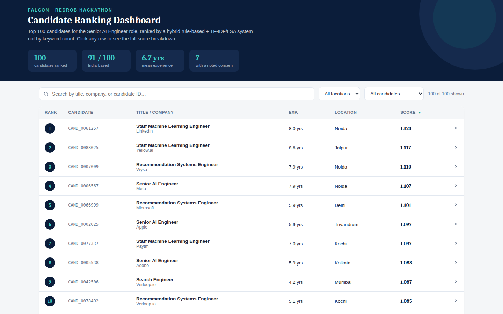
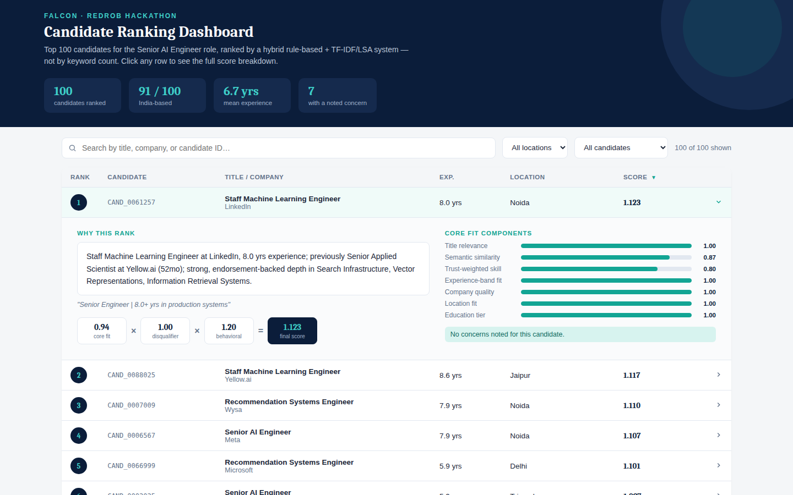
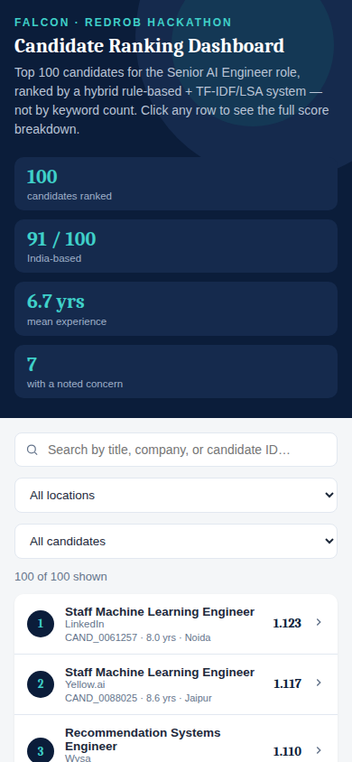

# Falcon — Redrob Hackathon: Intelligent Candidate Discovery & Ranking


Ranks the 100,000-candidate pool against the "Senior AI Engineer — Founding
Team" job description, producing the top-100 shortlist required by the
hackathon submission spec.

**Repo:** https://github.com/shaikasadahmed2k23/redrob-ranker <br>
**Sandbox:** https://hub.docker.com/r/shaikasadahmed/redrob-ranker-sandbox

## TL;DR

```bash
pip install -r requirements.txt
python src/rank.py --candidates ./candidates.jsonl --out ./submission.csv
python validate_submission.py ./submission.csv
```

Runtime: **~50-65 seconds** on a 16GB CPU-only machine for the full 100K pool
(well inside the 5-minute budget). No GPU, no network calls, no hosted LLM
calls anywhere in the ranking step.

## Results dashboard

A standalone, zero-dependency dashboard for browsing the top 100 — search,
filter, sort, and click any row to see the full
`core fit × disqualifier × behavioral` score breakdown. Open
`ui/dashboard.html` directly in a browser, no server needed.

| Overview | Score breakdown |
|---|---|
|  |  |

<details>
<summary>Mobile view</summary>



</details>

See `ui/README.md` for details and the Playwright test suite that covers it.

## Why this isn't a keyword matcher

The job description itself states the trap explicitly: *"The 'right answer'
to this JD is not 'find candidates whose skills section contains the most AI
keywords.'"* The dataset backs this up — see `notebooks/01_explore_data.py`
and `docs/approach.md` for the full exploration, but in short:

- The candidate pool draws from a **closed universe** of 63 companies, 48
  titles, and 133 skills. Rather than fuzzy-match these, we hand-classified
  every single one against the JD's stated preferences (see
  `src/reference_data.py`). This is more transparent and more reliable than
  hoping an embedding model infers that "Infosys" is a consulting company.
- A naive top-skill-count ranker (the bundled `sample_submission.csv`) ranks
  an **HR Manager** with 9 AI-sounding skill tags as the #1 candidate. Our
  system's skill score is **trust-weighted** by endorsements and
  duration-of-use, and blended with a title-tier score that an HR Manager
  scores ~0 on regardless of their skill list.
- ~80 honeypot candidates have subtly impossible profiles (e.g. "expert"
  proficiency in a skill used for 0 months). We detect and exclude **45** of
  them via two cheap, low-false-positive checks (see "Honeypot detection"
  below) — measured honeypot rate in our final top 100 is **0%**.

## Architecture

```
score = disqualifier_multiplier × behavioral_multiplier × core_fit_score
```

**`core_fit_score`** (0-1) is a weighted blend of seven components, each
computed per-candidate in `src/features.py`:

| Component | Weight | What it captures |
|---|---|---|
| Title relevance | 0.22 | Hand-tiered lookup over all 48 titles (`reference_data.TITLE_TIER`) |
| Career-history semantic similarity | 0.20 | TF-IDF + truncated SVD (LSA) cosine similarity between the JD and the candidate's career-history text |
| Trust-weighted skill match | 0.20 | Each of the 133 skills weighted by JD-relevance, then discounted unless backed by real endorsements + duration |
| Experience-band fit | 0.13 | Soft band around the JD's 5-9 year preference |
| Company quality / AI-relevance | 0.15 | Hand-classified company table (AI-native / big-tech / Indian product / SaaS / consulting / fictional-placeholder) |
| Location fit | 0.07 | Tier-1 Indian city preference, per the JD's explicit geography section |
| Education tier | 0.03 | Light weight — the JD doesn't emphasize pedigree |

**`disqualifier_multiplier`** (soft penalty, not necessarily zero) encodes
the JD's explicit "things we explicitly do NOT want" section: pure-research-
only careers, 100%-consulting-only careers, CV/speech-only specialists
without NLP/IR exposure, AI exposure limited to LangChain/RAG/Prompt-
Engineering with no retrieval/ranking depth, and a sustained title-hopping
pattern. These are soft multipliers because the JD itself hedges every one
of these ("we will *probably* not move forward") — see `docs/approach.md`
for why we rejected a few overly-blunt versions of these heuristics during
testing (e.g. an early "3+ short job stints" rule incorrectly penalized a
genuinely strong candidate who was just progressing quickly through a
fast-moving field).

**`behavioral_multiplier`** (~0.45-1.2x) implements the JD's explicit
instruction to down-weight "perfect-on-paper but unavailable" candidates,
using the 23 `redrob_signals` fields. Thresholds are calibrated against the
**pool's own percentile distribution** for each signal (computed in
`notebooks/01_explore_data.py`), not guessed absolute values — e.g. nobody
in the entire 100K pool has logged in within the last ~30 days, so an
absolute "active in the last 2 weeks" bonus would be dead code; we instead
score relative to the pool's actual p10/p25/p50/p75/p90.

### Honeypot detection

`src/features.py::is_honeypot()` checks two patterns, found by exploring the
actual data rather than guessing:

1. **"Expert" proficiency in a skill with 0 months of use** — internally
   impossible (21 candidates).
2. **Sum of `career_history` durations substantially exceeds stated
   `years_of_experience`** — impossible without overlapping full-time jobs,
   which nothing else in the schema supports (24 candidates).

We deliberately did **not** chase the full ~80 with looser heuristics.
Several plausible-sounding checks (salary `min > max`, education ending
after the first job's start date, a skill's `duration_months` exceeding
total experience) each fired on **15-20% of the entire pool** — far too
common to be the intended traps, just noise in the synthetic data generator.
Honeypots are **excluded from scoring entirely**, not just down-weighted,
per the hackathon's 10%-in-top-100 disqualification rule. Measured rate in
our final submission: 0/100.

### Why TF-IDF/LSA instead of a transformer embedding model

Loading a transformer and running it over 100K career-history texts on CPU
consumes a meaningful slice of the 5-minute budget by itself, before any
scoring logic runs, and the JD explicitly rewards exactly this kind of
latency-quality tradeoff thinking ("plan for a small ranker over
precomputed features, indexes, or compact local models"). TF-IDF + LSA over
this kind of vocabulary-constrained professional text is a reasonable
middle ground: fast, fully local, and fully inspectable (we can show
exactly which terms drove a similarity score). See `docs/approach.md` for
the longer version of this tradeoff discussion.

## Repository layout

```
src/
  rank.py            # main entrypoint -- scoring loop, reasoning generation, CSV writer
  features.py         # per-candidate feature extraction (honeypot detection,
                       # disqualifiers, core-fit components, behavioral multiplier)
  reference_data.py   # hand-curated lookup tables (companies, titles, skills, locations)
  semantic.py          # TF-IDF + LSA semantic similarity
tests/
  test_features.py    # unit tests for honeypot detection, disqualifiers, scoring
notebooks/
  01_explore_data.py  # exploratory analysis that produced every threshold/table above
docs/
  approach.md          # longer write-up of design decisions and what we tried/rejected
ui/
  dashboard.html        # standalone, zero-dependency dashboard for browsing the top 100
                        # (see ui/README.md -- open it directly, no server needed)
data/
  job_description.md   # JD text, extracted from the hackathon bundle
  falcon.csv / falcon.xlsx / falcon_approach_deck.pdf  # submission deliverables
deck/
  official_template/    # the approach deck, built on the official India.Runs template
sandbox/
  README.md             # how to build/run the Docker sandbox, plus hosted alternatives
validate_submission.py  # the hackathon's official format validator
submission_metadata.yaml
requirements.txt
```

## Reproducing the submission

```bash
pip install -r requirements.txt
python src/rank.py --candidates ./candidates.jsonl --out ./submission.csv
```

This single command produces `submission.csv` end-to-end from the raw
candidate pool: no manual edits, no pre-computation step, no hidden state.

To verify the format before submitting:

```bash
python validate_submission.py ./submission.csv
```

To run the test suite:

```bash
python -m unittest discover tests -v
```

## Compute constraints — measured, not assumed

| Constraint | Limit | Measured |
|---|---|---|
| Wall-clock runtime (100K candidates) | ≤ 5 min | ~50-65 sec |
| Peak memory | ≤ 16 GB | ~2.8 GB |
| GPU | None used | Confirmed — CPU only |
| Network calls during ranking | None | Confirmed — zero network calls in `src/` |

## Sandbox

A Docker image is live and pullable — runs the ranker end-to-end against a
50-candidate sample with zero setup:

```bash
docker run --rm shaikasadahmed/redrob-ranker-sandbox
```

See `sandbox/README.md` for the Dockerfile and hosted alternatives
(HuggingFace Spaces, Colab, Replit, Binder).

